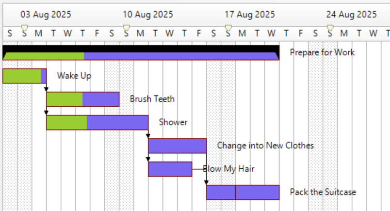
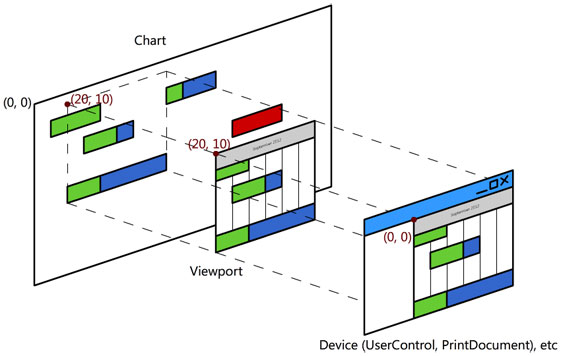

  

# .NET C# Winforms Gantt Chart Control
This .NET class library project provides a C# Winforms UserControl that draws a gantt chart using native GDI+.

## Getting Started
The project is written with Microsoft Visual Studio 2022, simply download the latest source code from the master branch and build the library with the IDE.

### Prerequisites
* .NET Framework 4.8 or higher
* Visual Studio 2017 or later (recommended: Visual Studio 2022)

### Installing
The project builds into a class library with example applications.

## Running the tests
The source code includes a test project GanttChartNUnitTests which you can load and run within Microsoft Visual Studio from the test menu or using the NUnit test runner.

## Features
* Support time units Weeks, Days (default), Hours out-of-the-box, can be modified to support other time resolutions.
* Single tasks, grouped tasks, precedent/dependant tasks, split tasks, tagged resources
* Printing respects page margin, orientation and multiple pages per page
* Percentage complete property for each task
* Various mouse events for customising UI experience directly on the chart.
* Comes with default mouse commands that can be overridden through inheritance.
* Determines critical path and slack

# Documentation
Jump directly to the [documentation](https://jakesee.github.io/ganttchart/) for more information.

## Basic Usage
### Create Chart and Adding Tasks

	public Form1()
	{
	    InitializeComponents();
	    var manager = new ProjectManager();
	    var task = new Task() { Name = "Hello World" };
	    manager.Add(task);
	    var chart = new Chart();
	    chart.Init(manage);

	    this.Controls.Add(chart);

	    this.AutoScroll = true; // this is no longer required
	}

### Common Task Manipulation
You can manipulate the task through code using various methods in the ProjectManager:

	// Set task durations
	_mManager.SetDuration(wake, 3);
	// Give the Tasks some organisation, setting group and
	// precedents e.g. make "wake" task a subtask under "work"
	_mManager.Group(work, wake);
	// Setting task dependencies e.g. make "wake" task a precedent of "brush teeth" task
	_mManager.Relate(wake, teeth);
	// Assigning Resources e.g. add "jake" resource to "wake" task
	_mManager.Assign(wake, jake);
	// splitting a tasks e.g. split the "pack up" task into 2 new tasks
	_mManager.Split(pack, new MyTask(_mManager), new MyTask(_mManager), 2);
	// set some tooltips to show the resources in each task
	// e.g. set a tooltip on the "wake" task
	_mChart.SetToolTip(wake, string.Join(", ", _mManager.ResourcesOf(wake).Select(x => (x as MyResource).Name)));

### Custom Task Data: Different colors for every tasks
You can change the default task appearance for all task, or as in here change individual task color as a demo for adding custom business data to tasks.

	public partial class ExampleSimple : Form
	{
	  ProjectManager _mProject;
	  public ExampleSimple()
	  {
	    InitializeComponent();
	    _mProject = new ProjectManager();
	    _mProject.Add(new Task() { Name = "New Task" });
	    _mProject.Add(new ColoredTask() { Name = "Purple Task", Color = Color.Purple });
	    _mProject.Add(new ColoredTask() { Name = "Gold Task", Color = Color.Gold });
	    _mChart.Init(_mProject);
	    // Custom behavior on paint task
	    _mChart.PaintTask += (s, e) =>
	    {
	        ColoredTask ctask = e.Task as ColoredTask;
	        if (ctask != null)
	        {
	            var format = new TaskFormat();
	            format = e.Format;
	            format.BackFill = new SolidBrush(ctask.Color);
	            e.Format = format;
	        }
	    };

	    // Grab custom data for tasks
	    _mChart.TaskSelected += (s, e) =>
	    {
	        ColoredTask ctask = e.Task as ColoredTask;
	        if (ctask != null)
	        {
	            MessageBox.Show("Selected " + ctask.Color.ToString());
	        }
	    };
	  }
	}

	// Custom task with business data
	public class ColoredTask : Task
	{
	    public ColoredTask() : base() {}
	    public Color Color { get; set; }
	}
## License
This project is licensed under the MIT License - see the [LICENSE.md](LICENSE.md) file for details
